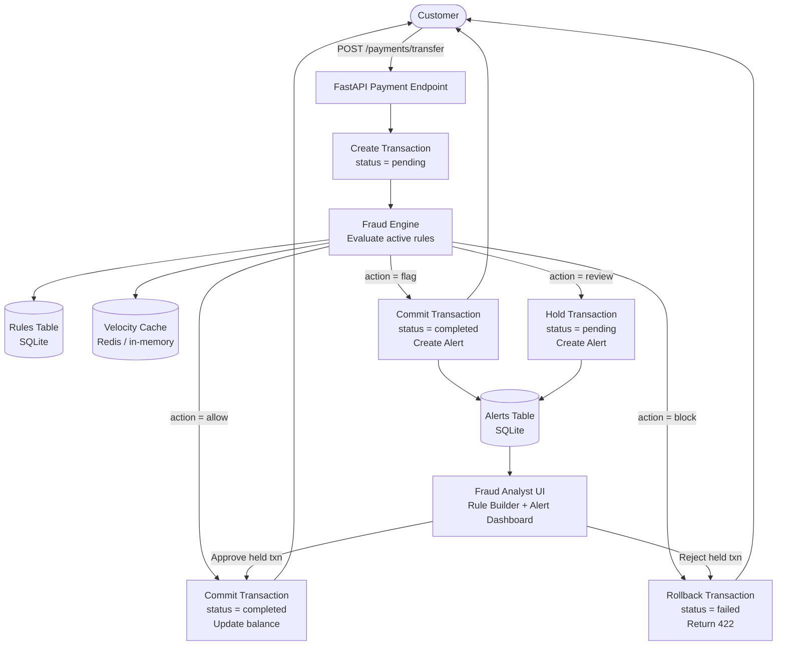
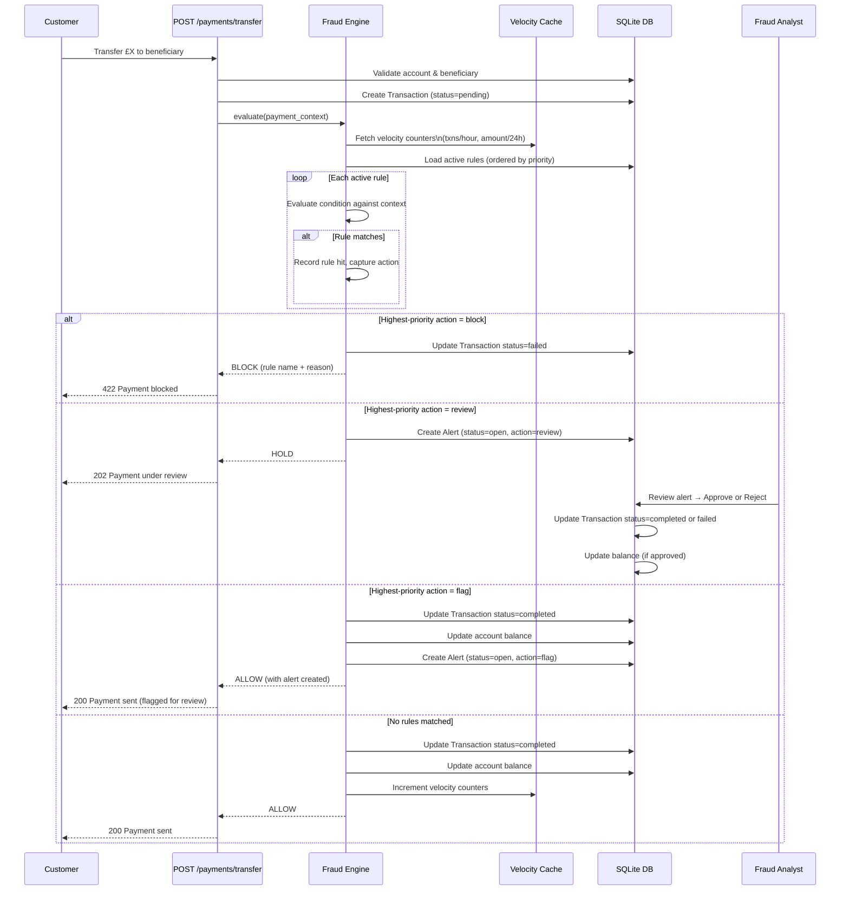

# Fraud Analytics — Architecture & Implementation Plan

## Overview

Fraud analytics sits as a **synchronous gate** inside the payment journey. When a customer initiates a transfer, the transaction is created in `pending` status, the fraud engine evaluates all active rules against the payment context, and only then is the outcome decided — block, flag for review, or allow. Fraud analysts have a dedicated UI to write and manage rules, review alerts, and approve or reject held transactions.

---

## System Architecture



---

## Payment Journey — Detailed Flow



---

## Database Schema

### Table 1 — `fraud_rules`

Stores all rules created by fraud analysts. Conditions are stored as JSON so analysts can build complex logic without code changes.

| Column | Type | Description |
|---|---|---|
| `rule_id` | INTEGER PK | Auto-increment |
| `name` | VARCHAR(255) | Human-readable name e.g. "High value new beneficiary" |
| `description` | TEXT | What the rule detects |
| `condition` | JSON | Rule logic (see below) |
| `action` | ENUM | `block` / `flag` / `review` |
| `severity` | ENUM | `low` / `medium` / `high` / `critical` |
| `priority` | INTEGER | Lower = evaluated first; highest-priority triggered action wins |
| `is_active` | BOOLEAN | Soft enable/disable without deleting |
| `created_by` | VARCHAR(255) | Analyst email |
| `created_at` | DATETIME | |
| `updated_at` | DATETIME | |
| `hit_count` | INTEGER | Running count of how many times this rule has fired |
| `last_hit_at` | DATETIME | Last time this rule triggered |

**Condition JSON format:**

Simple rule:
```json
{ "type": "simple", "field": "amount", "operator": "gt", "value": 5000 }
```

Compound rule (AND / OR):
```json
{
  "type": "and",
  "conditions": [
    { "type": "simple", "field": "amount", "operator": "gt", "value": 1000 },
    { "type": "simple", "field": "is_new_beneficiary", "operator": "eq", "value": true }
  ]
}
```

**Available fields for rule conditions:**

| Field | Source | Description |
|---|---|---|
| `amount` | Payment request | Transaction amount in GBP |
| `is_new_beneficiary` | DB | First ever payment to this beneficiary |
| `beneficiary_added_days_ago` | DB | Days since beneficiary was created |
| `is_external_beneficiary` | DB | Beneficiary is outside AI-Bank |
| `transactions_last_1h` | Cache | Count of customer transactions in last hour |
| `transactions_last_24h` | Cache | Count in last 24 hours |
| `amount_sent_last_24h` | Cache | Total £ sent in last 24 hours |
| `amount_pct_of_balance` | DB | This transaction as % of current balance |
| `account_age_days` | DB | How old the customer's account is |
| `hour_of_day` | Server time | 0–23 (detect unusual hours) |
| `day_of_week` | Server time | 0=Monday, 6=Sunday |

**Supported operators:** `gt`, `gte`, `lt`, `lte`, `eq`, `neq`

---

### Table 2 — `fraud_alerts`

Created whenever a rule with action `flag` or `review` fires.

| Column | Type | Description |
|---|---|---|
| `alert_id` | INTEGER PK | Auto-increment |
| `transaction_id` | INTEGER FK → transactions | The payment that triggered this |
| `customer_id` | INTEGER FK → customers | |
| `rule_id` | INTEGER FK → fraud_rules | Which rule fired |
| `action` | ENUM | `flag` / `review` / `block` (for audit) |
| `severity` | ENUM | Copied from rule at time of firing |
| `status` | ENUM | `open` / `investigating` / `approved` / `rejected` / `false_positive` |
| `rule_snapshot` | JSON | Copy of rule condition at time of firing (for audit trail) |
| `context_snapshot` | JSON | The evaluated payment context (amounts, velocity counters, etc.) |
| `analyst_notes` | TEXT | Free-text notes from the reviewing analyst |
| `reviewed_by` | VARCHAR(255) | Analyst email |
| `created_at` | DATETIME | When alert was raised |
| `reviewed_at` | DATETIME | When analyst actioned it |

---

## Velocity Cache (Redis / In-Memory)

For fields like `transactions_last_1h` and `amount_sent_last_24h`, hitting the database on every payment is slow. These counters live in a cache:

```
Key pattern:  fraud:velocity:{customer_id}:{window}
Windows:      1h, 24h, 7d
Values:       { count: N, total_amount: X.XX }
TTL:          Matches window size
```

For the initial build, an **in-memory dict** (TTL-aware) is sufficient since this is SQLite/single-process. When scaling to a real deployment, swap for Redis with no code changes beyond the cache adapter.

---

## Fraud Engine — Rule Evaluation Logic

```
function evaluate(payment_context, db, cache):
    1. Build context dict from payment_context + DB lookups + cache
    2. Load all active rules ordered by priority ASC
    3. For each rule:
        a. Evaluate condition JSON against context
        b. If match: record (rule, action, severity)
    4. If no rules matched → return ALLOW
    5. From matched rules, pick highest-severity action:
       block > review > flag
    6. Return (action, matched_rule, context)
```

Action precedence: `block` overrides `review` overrides `flag`.

---

## Backend API Endpoints

### Rules
| Method | Path | Description |
|---|---|---|
| `GET` | `/fraud/rules` | List all rules (with hit counts) |
| `POST` | `/fraud/rules` | Create a new rule |
| `GET` | `/fraud/rules/{id}` | Get rule detail |
| `PATCH` | `/fraud/rules/{id}` | Update rule (condition, action, active status) |
| `DELETE` | `/fraud/rules/{id}` | Soft-delete (set is_active=false) |
| `POST` | `/fraud/rules/{id}/test` | Dry-run a rule against a sample payment context |

### Alerts
| Method | Path | Description |
|---|---|---|
| `GET` | `/fraud/alerts` | List alerts (filter by status, severity, date) |
| `GET` | `/fraud/alerts/{id}` | Alert detail with full context snapshot |
| `PATCH` | `/fraud/alerts/{id}/approve` | Approve held transaction → completes payment |
| `PATCH` | `/fraud/alerts/{id}/reject` | Reject → transaction failed, balance not touched |
| `PATCH` | `/fraud/alerts/{id}/false-positive` | Mark as false positive for rule tuning |
| `PATCH` | `/fraud/alerts/{id}/investigate` | Mark as under investigation |

### Analytics
| Method | Path | Description |
|---|---|---|
| `GET` | `/fraud/stats` | Rule hit rates, false positive rates, alert volumes by severity |

---

## Frontend — Fraud Analyst Portal

A separate section of the dashboard accessible at `/fraud` (role-gated in future; open for now).

### Pages

```
/fraud                        Overview: open alerts count, recent hits, stats
/fraud/rules                  Rule list — sortable by priority, severity, hit count
/fraud/rules/new              Rule builder form
/fraud/rules/{id}             Rule detail + edit + test panel
/fraud/alerts                 Alert queue — filter by status/severity
/fraud/alerts/{id}            Alert detail — full context, approve/reject/FP buttons
```

### Rule Builder UI

The rule builder converts a form into the condition JSON. Analysts do not write JSON directly.

**Simple rule form:**
```
Field:     [amount ▼]
Operator:  [greater than ▼]
Value:     [5000]
```

**Compound rule:**
```
Match:  [ALL of ▼] the following conditions:
  ├─ Field [amount] [>] [1000]
  └─ Field [is_new_beneficiary] [=] [true]
[+ Add condition]
```

**Rule metadata:**
```
Name:        High value to new beneficiary
Description: Flags payments over £1k to a beneficiary added in last 7 days
Action:      [review ▼]
Severity:    [high ▼]
Priority:    10
Active:      [✓]
```

**Test panel (dry-run):**
```
Test against sample context:
  amount:                 1500
  is_new_beneficiary:     true
  beneficiary_added_days_ago: 2
  ...
→ Result: MATCH → action: review
```

### Alert Dashboard

- Table of open alerts with columns: Date, Customer, Amount, Beneficiary, Rule, Severity, Status
- Click-through to alert detail showing:
  - Payment context snapshot (what values were evaluated)
  - Rule condition that fired
  - Full transaction details
  - Action buttons: **Approve** / **Reject** / **False Positive** / **Investigate**
  - Analyst notes text field

---

## Out-of-Scope Checklist Rules (Starter Set)

These rules should be seeded into the database on first startup to demonstrate the system:

| Name | Condition | Action | Severity |
|---|---|---|---|
| Large single payment | amount > £10,000 | block | critical |
| High value to new beneficiary | amount > £1,000 AND is_new_beneficiary = true | review | high |
| New beneficiary same day | is_new_beneficiary = true AND beneficiary_added_days_ago < 1 | flag | medium |
| Velocity — 5 payments in 1 hour | transactions_last_1h >= 5 | review | high |
| Unusual hours | hour_of_day < 4 OR hour_of_day > 23 | flag | low |
| More than 80% of balance | amount_pct_of_balance > 80 | flag | medium |
| Daily limit exceeded | amount_sent_last_24h > £5,000 | block | critical |
| New account large payment | account_age_days < 30 AND amount > £500 | review | high |

---

## Delivery Order

| Step | Work |
|---|---|
| 1 | Add `fraud_rules` and `fraud_alerts` tables to `models.py`; run migration |
| 2 | Build fraud engine (`backend/fraud/engine.py`) — context builder + condition evaluator |
| 3 | Add velocity cache (`backend/fraud/cache.py`) — in-memory with TTL |
| 4 | Wire fraud engine into `POST /payments/transfer` — evaluate before committing |
| 5 | Add fraud API routes (`backend/routers/fraud.py`) — rules CRUD + alert management |
| 6 | Seed starter rules on startup |
| 7 | Frontend: `/fraud/rules` list + rule builder form |
| 8 | Frontend: `/fraud/alerts` queue + alert detail with approve/reject |
| 9 | Frontend: `/fraud` overview stats page |

---

## What This Does NOT Cover (future phases)

- ML-based scoring (anomaly detection, behavioural models)
- Real-time streaming (Kafka / Flink) for high-volume environments
- Multi-factor re-authentication for flagged payments
- Watchlist / sanctions screening
- Customer communication (SMS/email on blocked payment)
- Role-based access control for the analyst portal
